# Fintech Trading System Clone 🚀


**Fintech Trading System Clone** is a next-generation, high-performance fintech backend designed to simulate a real-world stock exchange platform. It unifies **BIST (Istanbul Stock Exchange)**, **NASDAQ/NYSE (US Markets)**, and **Crypto** markets under a single hybrid trading engine.

This project is engineered to solve critical financial system challenges such as **High Concurrency**, **Data Consistency (ACID)**, and **Low Latency** using a polyglot communication strategy (GraphQL, gRPC, SSE, WebSocket).

---

## 🏗 Architecture

The project follows **Hexagonal Architecture (Ports and Adapters)** to isolate the core business logic. It employs a **Hybrid API Gateway** approach **(BFF Pattern)** to optimize data delivery for mobile clients.

### System Overview
The system adopts a modular approach, utilizing **Event-Driven Architecture** for order processing and **Synchronous (gRPC)** communication for critical balance checks.

### System Overview & Communication Protocols

The system uses specific protocols for specific use cases to minimize latency and network overhead:

*   **GraphQL:** For fetching **static/slow-changing data** (User Profile, Wallet Balance, Stock Details) to prevent over-fetching on mobile screens.
    
*   **REST:** For standard **command operations** (Auth, Place Order, Deposit).
    
*   **gRPC:** For high-performance **internal** service-to-service communication (Order <-> Wallet).
    
*   **WebSocket:** Strictly for **streaming real-time volatile data** (Live Price Ticker).
    
*   **SSE (Server-Sent Events):** For lightweight, uni-directional **notifications** (e.g., "Order Filled").

```mermaid
graph TD
    Client[📱 Mobile / Web Client]
    Gateway[🌐 API Gateway / BFF]
    
    %% Client Connections
    Client -->|GraphQL Query| Gateway
    Client -->|REST Command| Gateway
    Gateway -.->|SSE: Notifications| Client
    Gateway <==>|WebSocket: Ticker| Client

    subgraph "Core Domain (Hexagonal)"
        Gateway -->|REST/GraphQL| Wallet[💰 Wallet Service]
        Gateway -->|gRPC| Order[📝 Order Service]
        Gateway -->|WebSocket| Market[📈 Market Data Service]
        Gateway -->|REST| Notif[🔔 Notification Service]
    end

    subgraph "Infrastructure Adapters"
        Wallet -->|Persist| DB[(PostgreSQL)]
        Order -->|Produce| Kafka{Apache Kafka}
        Market -->|Pub/Sub| Redis[(Redis)]
        Notif -->|Consume| Kafka
    end
    
    Kafka -->|Consume| Engine[⚙️ Matching Engine]
    Engine -->|Event: TradeExecuted| Kafka

```


---

### Order Processing Flow (Saga Pattern)
The system ensures data consistency between Order and Wallet services using the **Choreography Saga Pattern**.


---

## 🧰 Tech Stack

Selected technologies represent the industry standard for high-throughput financial systems.

| Technology   | Version   | Purpose                                                                 |
|-------------|-----------|-------------------------------------------------------------------------|
| Java        | 21 LTS    | Leveraging Virtual Threads (Project Loom) for high-throughput I/O.      |
| Spring Boot | 3.2.x     | Dependency Injection and rapid microservice development.       
| Spring GraphQL | 1.2.x     | **BFF** Layer implementation to prevent over-fetching on mobile clients.            |
| PostgreSQL  | 16        | Relational storage with ACID guarantees for wallets and orders.         |
| Apache Kafka| 3.6       | Asynchronous event streaming for decoupling order processing.           |
| Redis       | 7.0       | In-memory caching for real-time tickers and session management.         |
| gRPC        | Proto-buf | Low-latency, type-safe inter-service communication.                     |
| WebSocket   | STOMP     | Real-time server-push updates for stock prices.                         |
| Docker      | Compose   | Containerization of the entire infrastructure stack. 
| SSE      | Standard   | **Server-Sent Events** for lightweight, unidirectional user notifications.                    |

---

## 🧩 Design & Architecture Patterns

This project implements various patterns to ensure scalability, reliability, and clean code.

### Architectural Patterns

- **Hexagonal Architecture:** Decoupling domain logic from infrastructure.
- **Saga Pattern (Choreography):** Managing distributed transactions across Order and Wallet services without two-phase commit (2PC).
- **Transactional Outbox Pattern:** Solving the “Dual Write” problem to ensure data consistency between PostgreSQL and Kafka.
- **CQRS:** Segregating read and write operations for optimized performance.

### Design Patterns (GoF)

- **Strategy Pattern:** Dynamic calculation of commission rates based on user tiers (VIP vs Standard) and market types.
- **Factory Pattern:** Creation logic for different order types (Market, Limit, Stop-Loss).
- **Observer Pattern:** Broadcasting price changes from Redis to WebSocket clients.
- **Builder Pattern:** Fluent object construction for complex entities using Lombok.
- **Optimistic Locking:** Handling race conditions in wallet transactions using version control.

---

## ⚡ Key Features

### 1. Hybrid Communication Strategy (Mobile-First)

- **GraphQL for Reads**: Fetching static data (Stock names, logos, User Portfolio) efficiently on app launch.

- **WebSocket for Ticker**: Streaming live, volatile market data (Green/Red price flashes).

- **SSE for Alerts**: Instant "Order Filled" notifications without the overhead of a full socket connection.

### 2. Multi-Market Support

- 🇹🇷 **BIST:** Handling daily limits and session hours tailored for the Turkish market.
- 🇺🇸 **NASDAQ/NYSE:** Supporting currency conversion and delayed data feeds.
- 🌕 **Crypto:** 24/7 trading capability with fractional asset support.

### 3. Secure Wallet & Ledger

- Implementation of **Double-Entry Bookkeeping** principles.
- Robust concurrency control to prevent negative balances during simultaneous transactions.

### 4. Real-Time Ticker

- High-frequency price updates pushed to clients via WebSockets.
- Redis Pub/Sub mechanism to handle thousands of concurrent subscribers.

---

## 🚀 Getting Started

Follow these steps to run the project locally.

### Prerequisites

- Java 21 SDK  
- Docker & Docker Compose  
- Maven  

### Installation

1. **Clone the repository**


```bash

git clone https://github.com/MertAtakanOnrat/fintech-trading-system-clone.git

cd fintech-trading-system-clone.git

```

2. Start Infrastructure (DB, Redis, Kafka)

```bash

docker-compose up -d

```

3. Build and Run

```bash

mvn clean install
mvn spring-boot:run

```

## 🧪 Testing Strategy


- **Unit Tests:** High coverage using JUnit 5 and Mockito for domain logic.

- **Integration Tests:** Utilizing Testcontainers to run tests against real PostgreSQL and Kafka instances in Docker.


---


## 🧾 License


This project is licensed under the MIT License – see the `LICENSE` file for details.
